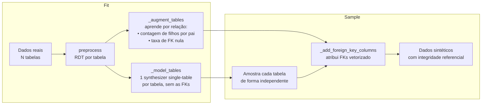

# Benchmark de escala multi-tabela: `IndependentSynthesizer` × `HMASynthesizer`

> Fork `dmux/SDVReal`, branch `feature/independent-multi-table-synthesizer` (commit `dd681257`) ·
> Issue [#1](https://github.com/dmux/SDVReal/issues/1) · Medições de 07/10/2026

## Sumário executivo

| Pergunta | Resposta curta |
|---|---|
| O SDV Community escala em multi-tabela? | **Com o `HMASynthesizer`, não.** Ele recusa schemas com mais de 5 tabelas ou profundidade maior que 2 e, mesmo dentro do limite, foi **52× mais lento** que a nova abordagem com 30 mil linhas. Com 119 mil linhas não terminou em 30 minutos. |
| A nova abordagem escala? | **Sim, em tempo.** O `IndependentSynthesizer` processou **5,57 milhões de linhas reais do CNPJ em 8 minutos**, num schema de 10 tabelas e 12 relações. O tempo cresce de forma linear (expoente 0,91). |
| Qual é o limite? | **Memória.** O custo é de ~1,27 KB por linha, quase todo de pandas, RDT e GaussianCopula. Num Mac de 16 GB o teto fica entre 5,6M e 11,1M linhas. |
| A base CNPJ inteira cabe? | **Não nesta máquina.** São 222M linhas, o que daria ~5,3 h de CPU e ~280 GB de RAM. Precisa de uma máquina maior ou de processamento em partes. |
| A qualidade relacional se mantém? | **Sim na cardinalidade e na integridade.** O KS foi de 0,000 em todos os tamanhos, a cauda real (uma empresa com 7.903 estabelecimentos) foi reproduzida, e 100% das FKs são válidas. **Não nas correlações entre tabelas:** só 85% a 93% das empresas sintéticas têm exatamente uma matriz, contra 100% no real. |

---

## 1. Contexto: por que uma nova abordagem

### 1.1 A trava do HMA

Em `sdv/multi_table/hma.py:261`:

```python
if num_tables > 5 or schema_depth > 2:
    raise SynthesizerInputError('... Please use SDV Enterprise to model this schema ...')
```

- Ela foi introduzida no commit `43310d3a` (28/07/2026). Esse commit substituiu um *aviso* baseado no custo estimado (número de colunas geradas) por um *erro* baseado só em contagem de tabelas e profundidade.
- O commit `adb52dd8` (27/08/2026) fez dela o primeiro erro exibido, já no `__init__`.
- A regra ignora o custo real. Um schema-estrela de 6 tabelas com ~31 colunas modeladas é recusado, e um de 2 tabelas com ~2.072 colunas modeladas é aceito.

### 1.2 Por que o HMA não escala, com ou sem a trava

| Ponto do código | Custo |
|---|---|
| `HMASynthesizer._get_extension` (`hma.py:341`) | Ajusta uma GaussianCopula **para cada linha do pai**: O(número de pais). |
| Achatamento dos parâmetros do filho em colunas do pai (`hma.py:70-114`) | n(n-1)/2 colunas de correlação mais k·n de parâmetros por relação, **em cascata** na profundidade. Uma cadeia de 4 tabelas com 1 coluna cada já gera ~1.000 colunas. |
| `_get_likelihoods` (`hma.py:701`) | O(pais × filhos) quando a FK precisa ser inferida. |
| `BaseHierarchicalSampler._sample_children` (`hierarchical_sampler.py:258`) | `iterrows()` por pai, com um sampling separado para cada um e `pd.concat` acumulado em loop. |

O synthesizer escalável que preencheria essa lacuna existe apenas no SDV Enterprise, embora o mixin `BaseIndependentSampler` (`sdv/sampling/independent_sampler.py`) esteja no código do Community sem nenhuma implementação concreta.

---

## 2. A nova abordagem: `IndependentSynthesizer`

Arquivo: `sdv/multi_table/independent.py`. A classe herda de `BaseIndependentSampler` e de `BaseMultiTableSynthesizer`.

### 2.1 Como funciona



1. **Fit, por tabela.** Cada tabela recebe o seu próprio synthesizer single-table (GaussianCopula por padrão, configurável com `set_table_parameters`). Ele é treinado sem as colunas de FK.
2. **Fit, por relação.** Para cada relação pai → filho (FK), o synthesizer guarda dois números:
   - a distribuição empírica de filhos por pai, `np.bincount` das contagens. O cálculo é vetorizado: `value_counts().reindex(parent_pk, fill_value=0)`;
   - a taxa de FK nula.
3. **Sampling.** Cada tabela é amostrada de forma independente. Depois, `_connect_tables` percorre o grafo em largura a partir das raízes e atribui as FKs:
   - **Contagens de filhos.** As contagens reais são **reamostradas sem reposição**: o conjunto inteiro se repete `⌊pais/pais_reais⌋` vezes, e o resto é sorteado sem reposição. Com escala 1, isso reproduz exatamente a distribuição real, inclusive a cauda.
   - **Ajuste da soma.** A pequena diferença entre a soma sorteada e o número de filhos é ajustada removendo ou repetindo chaves ao acaso.
   - **Valores da FK.** `np.repeat(parent_pk, counts)` gera as chaves, os nulos entram na proporção aprendida e o resultado é embaralhado.
   - **Relação 1-para-1** (a FK é a PK do filho): as chaves são sorteadas sem reposição.

### 2.2 Complexidade

| Etapa | HMA | Independent |
|---|---|---|
| Ajustes de modelo | 1 por tabela **+ 1 por linha de cada pai** | 1 por tabela |
| Colunas modeladas | crescem em cascata com a profundidade, de forma quadrática por relação | as colunas da própria tabela |
| Atribuição de FK | loop Python por pai | vetorizada, O(linhas) |
| Limite de schema | 5 tabelas, profundidade 2 | nenhum |

### 2.3 O que é e o que não é preservado

| Propriedade | Independent | HMA |
|---|---|---|
| Distribuição de cada coluna | ✅ | ✅ |
| Correlações dentro da tabela | ✅ | ✅ |
| Cardinalidade (filhos por pai) e taxa de FK nula | ✅ exata com escala 1 | ✅ aproximada |
| Integridade referencial | ✅ por construção | ✅ |
| **Correlação entre colunas de tabelas diferentes** (ex.: porte da empresa ↔ número de filiais) | ❌ | ✅ |
| **Regras entre linhas de um mesmo pai** (ex.: exatamente uma matriz por empresa) | ❌ | ❌ parcial |

---

## 3. Ambiente

| Item | Valor |
|---|---|
| Máquina | MacBook Pro (`Mac16,1`), Apple M4, 10 núcleos (4 de performance e 6 de eficiência) |
| RAM / swap | 16 GB / 2 GB |
| Disco livre | 141 GB |
| Sistema | macOS 26.6.2 |
| Python | 3.12.11 (venv criado com `uv`) |
| Bibliotecas | sdv 2.0.0.dev1 · rdt 2.0.0.dev0 · copulas 0.14.1 · pandas 2.3.3 · numpy 2.5.3 · scipy 1.18.1 · pyarrow 25.0.1 · faker 40.41.0 · sdmetrics 0.32.0 |
| Condições | Máquina de uso diário, com navegador, VS Code e outros apps abertos (~45% da RAM livre no início). Ligada na tomada durante as medições. |

---

## 4. Benchmark 1: schemas sintéticos

Arquivo `tests/benchmark/multi_table_scale.py`. Executar com `make test-scale` ou `invoke scale`.

Os schemas são árvores geradas por `tests.utils.generate_multi_table_schema`. Cada tabela tem 2 colunas numéricas, 1 categórica e 5% de FK nula, e as FKs são sorteadas de forma uniforme. A memória foi medida com `tracemalloc`, que deixa os tempos absolutos mais lentos; o que importa é a proporção entre eles. Todas as saídas passam em `metadata.validate_data`.

| Eixo | Entrada | Tempo (fit + sample) | Memória de pico (`tracemalloc`) |
|---|---|---|---|
| Linhas (10 tabelas, profundidade 4) | 10 mil → 100 mil → 1M | 8,5 s → 18,7 s → 112,1 s | 4,0 → 22,8 → 201,1 MB |
| Tabelas (2 mil linhas cada, profundidade 4) | 10 → 25 → 50 | 9,4 s → 23,9 s → 47,8 s | 6,2 → 15,5 → 31,1 MB |
| Profundidade (cadeia, 20 mil linhas cada) | 2 → 4 → 8 | 5,5 s → 10,7 s → 22,0 s | 11,5 → 21,5 → 43,0 MB |

- 10× mais linhas custam 2 a 6× mais tempo. Nos tamanhos pequenos domina o custo fixo de cada tabela.
- 5× mais tabelas custam 5,1× mais tempo.
- A memória por tabela fica constante (~5,4 MB) em qualquer profundidade.
- Todos esses schemas são recusados pelo `HMASynthesizer`.

> Essas medições usaram o algoritmo de cardinalidade da primeira versão (commit `2187442f`). A troca para reamostragem sem reposição (seção 7.1) não altera o custo assintótico.

O benchmark sintético comprova a escala da **camada multi-tabela**, mas não tem caudas pesadas, colunas largas, texto, PII nem datas sujas. Por isso o benchmark 2 usa dados reais.

---

## 5. Benchmark 2: dados abertos do CNPJ (Receita Federal)

### 5.1 A base

Release **2026-09**, obtida do compartilhamento Nextcloud da Receita Federal (`YggdBLfdninEJX9`) pelo WebDAV público. São 37 arquivos zip, 7,4 GB no total, todos com tamanho conferido contra o servidor.

| Tabela | Registros na base completa | Arquivos |
|---|---|---|
| Empresas | 70.085.592 | `Empresas0-9.zip` |
| Estabelecimentos (matrizes e filiais) | 73.366.147 | `Estabelecimentos0-9.zip` |
| Sócios | 28.341.092 | `Socios0-9.zip` |
| Simples Nacional / MEI | 50.396.768 | `Simples.zip` |
| Domínios: CNAEs, motivos, municípios, naturezas, países, qualificações | 7.408 no total | 6 arquivos |
| **Total** | **≈ 222 milhões** | |

Os arquivos são CSV sem cabeçalho, em latin-1, separados por `;` e com aspas.

### 5.2 Amostragem por empresa

`benchmarks/cnpj/prepare.py` lê cada zip uma única vez, em streaming com `pyarrow.csv` (blocos de 64 MB). Cada linha cai num *bucket* `int(cnpj_basico) % 10000`, e o script guarda as linhas com `bucket < fração × 10000`.

Como o bucket depende só da empresa, a amostra leva **todos** os estabelecimentos, sócios e registros do Simples das empresas sorteadas. Isso preserva a integridade referencial e as caudas da distribuição. As frações menores são subconjuntos da amostra preparada.

- A passada pela base inteira levou **84 s**, com 5,5 GB de RSS máximo, e produziu a amostra de 5% (11,1M linhas, 480 MB em Parquet).
- A amostra efetiva de 5% teve 5,01% das linhas, o que confirma que o bucket é uniforme.

### 5.3 Variantes de schema

| Variante | Tabelas | Relações | Profundidade | HMA aceita? |
|---|---|---|---|---|
| `core` | `empresas` → `estabelecimentos`, `socios`, `simples` | 3 | 2 | ✅ |
| `full` | `core` + `cnaes`, `motivos`, `municipios`, `naturezas`, `paises`, `qualificacoes` como tabelas-pai | 12 | 3 | ❌ |

A variante `full` exercita **várias FKs para o mesmo pai**: `socios.qualificacao_socio` e `socios.qualificacao_representante_legal` apontam para `qualificacoes`. Exercita também uma **relação 1-para-1** (`simples.cnpj_basico` é PK e FK para `empresas`) e tabelas **sem PK** (`socios`).

**Adaptações necessárias:**
- O SDV Community não aceita chave composta. A PK de `estabelecimentos` passou a ser o `cnpj` de 14 dígitos (`cnpj_basico + cnpj_ordem + cnpj_dv`).
- As datas `"0"` e `"00000000"` viram nulo (`to_datetime(format='%Y%m%d', errors='coerce')`). O `capital_social` usa vírgula decimal e foi convertido para número.
- Na variante `full`, códigos sem correspondência na tabela de domínio viram nulo. Isso afetou no máximo 0,02% dos valores (`motivo_situacao_cadastral`).

### 5.4 Tipos semânticos (sdtypes)

| Tipo | Colunas |
|---|---|
| `id` (chaves) | `cnpj_basico`, `cnpj` |
| PII gerada com Faker `pt_BR` | `razao_social`, `nome_fantasia` (company) · `nome_socio`, `nome_representante` (name) · `logradouro` (street_name) · `cep` (postcode) · `telefone_*`, `fax` (phone_number) · `correio_eletronico` (email) |
| `categorical` | natureza jurídica, porte, situação cadastral, CNAE principal, UF, município, bairro, DDDs, qualificações, faixa etária, opções do Simples/MEI etc. |
| `datetime` | datas de situação, de início de atividade, de entrada na sociedade e de opção/exclusão do Simples/MEI |
| `numerical` | `capital_social` |
| `unknown` | `cnae_fiscal_secundaria` (lista), `numero`, `complemento`, `cpf_cnpj_socio`, `representante_legal` |

> **LGPD:** os dados de sócios são públicos por lei, mas trazem nomes e CPFs parcialmente mascarados de pessoas físicas. Todas as colunas de nome são PII geradas pelo Faker, então a saída sintética não reproduz nomes reais. Os dados brutos ficam fora do repositório (`~/.cache/sdv-cnpj`).

### 5.5 Como foi medido

- **Isolamento:** cada combinação (synthesizer, variante, fração) roda num subprocesso próprio (`benchmarks/cnpj/run.py`).
- **Tempo por fase:** `load` (Parquet → pandas + limpeza), `init`, `preprocess` (RDT), `fit`, `sample`, `validate` (`metadata.validate_data`) e `quality`.
- **Memória:** o pico do **footprint físico** (`ri_lifetime_max_phys_footprint`, lido com `proc_pid_rusage`), que é o número do Monitor de Atividade e inclui páginas comprimidas. A leitura foi validada contra o `/usr/bin/time -l` (4,04 GiB nas duas).
- **Cortes de segurança:** o subprocesso é encerrado se o footprint passar de 80% da RAM (12,8 GB), se a memória disponível no sistema cair abaixo de 512 MB ou se passar do timeout.
- **Qualidade:**
  - `integrity`: a validação de integridade referencial do SDV passa;
  - KS de estabelecimentos por empresa e de sócios por empresa: estatística de Kolmogorov-Smirnov entre as distribuições real e sintética (0 = idênticas);
  - % de empresas com **exatamente uma matriz** (`identificador_matriz_filial == 1`), que é 100% no real.

---

## 6. Resultados

### 6.1 `IndependentSynthesizer`, variante `full` (10 tabelas, 12 relações)

| Amostra | Linhas | Tempo total | Memória de pico | Integridade | KS estab./empresa | KS sócios/empresa | Máx. estab./empresa (real / sintético) | 1 matriz por empresa |
|---|---|---|---|---|---|---|---|---|
| 0,1% | 237.237 | 26,9 s | 1,37 GB | ✅ | 0,000 | 0,000 | 7.903 / 7.903 | 84,8% |
| 0,25% | 570.123 | 54,3 s | 1,38 GB | ✅ | 0,000 | 0,000 | 7.903 / 7.903 | 90,3% |
| 0,5% | 1.125.695 | 101,7 s | 2,13 GB | ✅ | 0,000 | 0,000 | 7.903 / 7.903 | 91,9% |
| 1% | 2.239.828 | 202,5 s | 3,42 GB | ✅ | 0,000 | 0,000 | 7.903 / 7.903 | 92,5% |
| 2,5% | 5.572.002 | **477,4 s** | **7,36 GB** | ✅ | 0,000 | 0,000 | 7.903 / 7.903 | 93,2% |
| 5% | 11.127.857 | interrompida aos 850,8 s, no sampling | **12,86 GB** (limite) | — | — | — | — | — |

As médias de filhos por empresa ficaram idênticas entre real e sintético em todos os tamanhos (ex.: 1,053 estabelecimentos e 0,405 sócios por empresa em 2,5%).

**Tempo por fase (segundos):**

| Amostra | load | init | preprocess | fit | sample | validate |
|---|---|---|---|---|---|---|
| 0,1% | 0,90 | 1,28 | 4,90 | 8,46 | 7,62 | 1,89 |
| 0,5% | 1,68 | 1,28 | 17,68 | 43,65 | 30,86 | 3,99 |
| 1% | 3,11 | 1,28 | 33,66 | 93,94 | 60,06 | 6,90 |
| 2,5% | 8,46 | 1,33 | 83,87 | 204,54 | 154,24 | 16,38 |
| 5% (interrompida) | 18,9 | 1,4 | 178,08 | 434,81 | — | — |

Em 2,5%, o tempo se divide em **fit 43%, sample 33%, preprocess 18%**, validate 3,5% e load 1,8%.

**Memória de pico acumulada ao fim de cada fase (GB):**

| Amostra | load | preprocess | fit | sample |
|---|---|---|---|---|
| 1% | 2,34 | 3,33 | 3,42 | 3,42 |
| 2,5% | 4,26 | 7,34 | 7,36 | 7,36 |
| 5% | **7,14** | **9,76** | **11,47** | > 12,86 (corte) |

### 6.2 `IndependentSynthesizer` × `HMASynthesizer`, variante `core` (4 tabelas)

| Amostra | Linhas | Independent | HMA | Razão de tempo |
|---|---|---|---|---|
| 0,01% | 30.065 | **16,1 s** · 0,92 GB | **833,1 s** · 1,27 GB | **52×** |
| 0,05% | 118.889 | **37,9 s** · 0,91 GB | **interrompido por timeout (1.800 s)** · 2,32 GB | > 47× |
| 0,1% | 229.829 | 58,9 s · 1,18 GB | não executado (a escada para no primeiro corte) | — |
| 0,25% | 562.715 | 120,9 s · 1,55 GB | não executado | — |

**Tempo por fase com 30 mil linhas (segundos):**

| Fase | Independent | HMA | Razão |
|---|---|---|---|
| preprocess | 2,23 | 4,36 | 2× |
| fit | 1,83 | 42,66 | **23×** |
| sample | 4,49 | **776,04** | **173×** |

Com 119 mil linhas, o fit do HMA levou 236,1 s contra 10,37 s do Independent (23×). O sampling do HMA, projetado de forma linear em ~3.000 s, estourou o timeout.

**Qualidade com 30 mil linhas:**

| Métrica | Real | Independent | HMA |
|---|---|---|---|
| KS estabelecimentos/empresa | — | **0,000** | 0,031 |
| KS sócios/empresa | — | **0,000** | 0,140 |
| Máx. estabelecimentos/empresa | 7.903 | **7.903** | 127 |
| Máx. sócios/empresa | 41 | **41** | 3 |
| Empresas com exatamente 1 matriz | 100% | 45,9% | **79,5%** |
| Integridade referencial | — | ✅ | ✅ |

O HMA perde a cauda (o máximo de estabelecimentos cai de 7.903 para 127), mas respeita melhor a regra da matriz, porque condiciona os filhos ao pai. É o trade-off da seção 2.3, agora medido.

---

## 7. Problemas encontrados com dados reais (já corrigidos)

O benchmark sintético não revelou nenhum destes problemas. Todos foram corrigidos no commit `dd681257` e cobertos por testes.

### 7.1 Cauda pesada perdida ou duplicada

A primeira versão sorteava a contagem de filhos de cada pai **de forma independente**, a partir da distribuição empírica. A amostra de 0,1% tem uma empresa com 7.903 estabelecimentos em 70 mil empresas. Quando o sorteio não a pegava, o déficit de ~7,9 mil filhos era espalhado por empresas que tinham 1 filho; quando a pegava duas vezes, o excesso era cortado de todo mundo.

| Versão | KS estab./empresa (0,1%) | Máx. sintético (2,5%) |
|---|---|---|
| Sorteio independente | **0,222** | 1.502 (real: 7.903) |
| Reamostragem sem reposição | **0,000** | 7.903 |

Teste: `test__sample_foreign_key_values_keeps_heavy_tail`.

### 7.2 FK 100% nula com chave do pai em texto

Uma FK totalmente nula (por exemplo `estabelecimentos.pais` na amostra) gerava uma coluna `float64`. O `validate_data` do SDV então falhava ao cruzá-la com a PK do pai, que é texto: `You are trying to merge on float64 and object columns`. Agora o synthesizer mantém o tipo `object` quando a chave do pai é texto.

Teste: `test__add_foreign_key_columns_all_null_string_keys`.

### 7.3 O RSS subestima a memória no macOS

A primeira rodada mediu o RSS, que **não inclui páginas comprimidas**. Em 2,5% o RSS indicava 4,78 GB contra 7,36 GB de footprint real, e em 5% indicava 5,42 GB. Por isso a primeira rodada chegou a completar os 5% (11,1M linhas em 998,8 s): o macOS estava comprimindo memória além do orçamento. A métrica foi trocada pelo footprint físico. Os dados da primeira rodada estão em `results_v1_rss.jsonl`.

Também foi corrigido o carregamento: o `dataset.load` lia o Parquet inteiro da amostra antes de filtrar. Agora lê em lotes de 50 mil linhas, o que tirou ~1 GB fixo de cada medição.

---

## 8. Análise

### 8.1 Linearidade

- **Tempo:** de 0,1% para 2,5%, as linhas crescem 23,5× e o tempo 17,7×. Num ajuste log-log, `tempo ∝ linhas^0,91`. Isso é linear, com custo fixo diluído. O custo marginal é de ~86 µs por linha (~11.700 linhas/s no pipeline completo).
- **Memória:** o custo marginal é de ~1,27 KB por linha (de 1% para 2,5%). O crescimento também é linear, mas a constante é alta.
- **Estrutura do schema:** sem efeito. O número de tabelas, a profundidade e o número de FKs não alteram o custo por linha.

### 8.2 Onde está o gargalo

1. **Memória do pandas e do RDT**, não do synthesizer. Só carregar 11,1M linhas, com 54 colunas no total (a maioria texto), já consome 7,1 GB. O preprocess do RDT soma ~2,6 GB, e o fit mais ~1,7 GB.
2. **Fit e sample da GaussianCopula por tabela** (76% do tempo), em **um núcleo só**: 9 dos 10 núcleos ficam parados.
3. **O Faker no sampling.** São 10 colunas de PII geradas linha a linha. Está dentro dos 33% do sampling, mas não foi isolado.

A parte nova da camada multi-tabela (cardinalidade e atribuição vetorizada de FK) não foi cronometrada isoladamente. Ela fica dentro das fases `fit` e `sample` e é O(linhas); isolar esse custo é um item da seção 10.

### 8.3 Projeção para a base completa (222M linhas)

| Recurso | Estimativa linear | Viável neste Mac? |
|---|---|---|
| Tempo | 222M × 86 µs ≈ **5,3 h** | sim |
| Memória | 222M × 1,27 KB ≈ **280 GB** | ❌ (16 GB) |

Caminhos para processar a base inteira:
- uma máquina com 384 GB ou mais de RAM;
- ajustar o modelo numa amostra (por exemplo 2,5%) e **amostrar em lotes** até 222M linhas. O fit é O(amostra) e o sampling pode ser escrito em disco aos poucos;
- tipos mais leves: categorias do pandas e strings do Arrow em vez de `object`.

### 8.4 Quando usar cada synthesizer

| Cenário | Recomendação |
|---|---|
| Massa de dados para carga, QA ou desenvolvimento, com integridade referencial | **Independent** |
| Schemas com mais de 5 tabelas ou profundidade maior que 2 | **Independent** (único que aceita) |
| Mais de ~50 mil linhas | **Independent** (o HMA passa de 30 min) |
| Análises que dependem de correlação entre tabelas (features de JOIN, agregações filho por atributo do pai) | HMA, se o schema for pequeno; ou o Independent com condicionamento (seção 10) |
| Regras entre linhas do mesmo pai (1 matriz por empresa) | Nenhum dos dois garante; precisa de constraint ou pós-processamento |

---

## 9. Limitações e ameaças à validade

- **Uma execução por ponto.** As duas rodadas completas da escada variaram no máximo 1,5% no tempo, o que indica estabilidade, mas não há intervalo de confiança.
- **Máquina compartilhada.** Outros apps ocupavam ~55% da RAM no início. Numa máquina dedicada o teto de memória seria maior.
- **HMA com poucos pontos.** Só 30 mil linhas completaram. O ponto de 119 mil é um limite inferior (> 1.800 s).
- **CNPJ sintético não é válido como CNPJ.** O `cnpj` de 14 dígitos é gerado sem relação com o `cnpj_basico`, e o dígito verificador sai inválido. Para teste de carga isso é aceitável.
- **Domínios como FK** (variante `full`) fazem o código de município perder a correlação com a UF, porque a FK é sorteada. A variante `core` mantém esses códigos como categóricos.
- **O benchmark sintético usou `tracemalloc`**, que pesa no tempo absoluto. Só as proporções entre tamanhos são comparáveis.

---

## 10. Próximos passos

1. **Fit em paralelo por tabela.** As tabelas são independentes, então daria para usar os 10 núcleos, ao custo de mais memória. Ganho esperado de 3 a 4× no fit.
2. **Sampling em lotes com escrita em disco**, para gerar a base inteira a partir de um modelo ajustado em amostra.
3. **Condicionar filhos a colunas do pai.** Propagar uma ou duas colunas do pai para o filho (ex.: `porte_empresa` → `estabelecimentos`) e amostrar condicionado. Recupera as correlações escolhidas com custo O(linhas).
4. **Cardinalidade condicionada ao pai**, por faixa de alguma coluna do pai.
5. **Regra de uma matriz por empresa** como constraint ou pós-processamento por grupo.
6. **Repetir em máquina dedicada** com 64 GB ou mais, para medir 5% a 25% da base.
7. **Instrumentar o custo da camada multi-tabela** (aprendizado de cardinalidade e atribuição de FK) separado do custo das tabelas, além do Faker no sampling.

---

## 11. Como reproduzir

```bash
# ambiente
uv venv --python 3.12 .venv && uv pip install --python .venv -e '.[dev]'

# benchmark sintético (~4,5 min)
make test-scale

# dados do CNPJ (~7,4 GB, release 2026-09)
RELEASE=2026-09; DEST=~/.cache/sdv-cnpj/$RELEASE; mkdir -p $DEST && cd $DEST
SHARE=https://arquivos.receitafederal.gov.br/public.php/webdav
curl -s -u "YggdBLfdninEJX9:" -X PROPFIND -H "Depth: 1" $SHARE/$RELEASE/ \
  | grep -oE '[A-Za-z]+[0-9]?\.zip' | sort -u \
  | xargs -P 4 -I{} curl -sS --retry 5 -C - -u "YggdBLfdninEJX9:" -o {} $SHARE/$RELEASE/{}
cd -

# amostra de 5% por empresa (~1,5 min)
.venv/bin/python benchmarks/cnpj/prepare.py --release-dir ~/.cache/sdv-cnpj/2026-09 --max-fraction 0.05

# escada do Independent, variante full (~15 min até 2,5%)
.venv/bin/python benchmarks/cnpj/run.py --sample-dir ~/.cache/sdv-cnpj/2026-09/sample_0.05 \
  --synthesizer independent --variant full --fractions 0.001 0.0025 0.005 0.01 0.025 0.05

# comparação com o HMA, variante core
.venv/bin/python benchmarks/cnpj/run.py --sample-dir ~/.cache/sdv-cnpj/2026-09/sample_0.05 \
  --synthesizer independent --variant core --fractions 0.0001 0.0005 0.001 0.0025 --timeout 1800
.venv/bin/python benchmarks/cnpj/run.py --sample-dir ~/.cache/sdv-cnpj/2026-09/sample_0.05 \
  --synthesizer hma --variant core --fractions 0.0001 0.0005 0.001 0.0025 --timeout 1800
```

Os resultados ficam em `~/.cache/sdv-cnpj/2026-09/sample_0.05/results.jsonl`, uma linha JSON por execução. Se o perfil AWS da máquina apontar o S3 para um endpoint local (localstack), os testes de integração que baixam datasets de demo precisam de `env -u AWS_PROFILE`.

---

## Arquivos

| Arquivo | Conteúdo |
|---|---|
| `sdv/multi_table/independent.py` | `IndependentSynthesizer` |
| `tests/unit/multi_table/test_independent.py` | 14 testes unitários |
| `tests/integration/multi_table/test_independent.py` | 6 testes de integração |
| `tests/benchmark/multi_table_scale.py` | benchmark sintético (marker `scale`) |
| `tests/utils.py` (`generate_multi_table_schema`) | gerador de schemas sintéticos |
| `benchmarks/cnpj/prepare.py` | download → amostra Parquet por empresa |
| `benchmarks/cnpj/dataset.py` | dados e metadata das variantes `core` e `full` |
| `benchmarks/cnpj/run.py` | orquestrador com medição de footprint, timeout e métricas |

## Fontes

- [Repositório de Dados Abertos da RFB](https://www.gov.br/receitafederal/dados)
- [Portal de Dados Abertos: CNPJ](https://dados.gov.br/dados/conjuntos-dados/cadastro-nacional-da-pessoa-juridica---cnpj)
- [rictom/cnpj-sqlite](https://github.com/rictom/cnpj-sqlite) (referência de volume da base)
